# web-solitaire

Eleven solitaires, in a browser, for one person. No account, no server, no
network — the game is a directory of static files, and everything it remembers
about you is in your browser's own storage.

**Play it: [solitaire.exterkamp.codes](https://solitaire.exterkamp.codes)**

**Build and sort** — an evening's game, or a quarter of an hour of one.

<table>
<tr>
<td width="25%" align="center">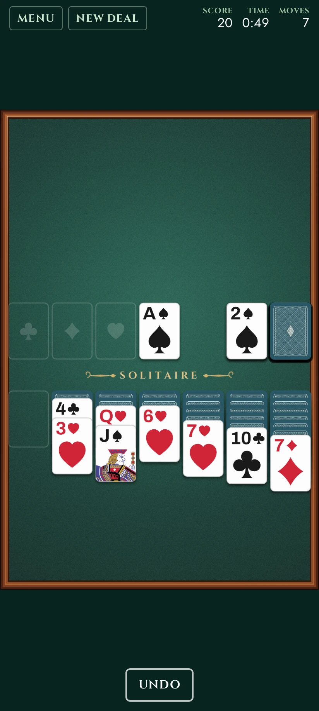<br><b>Klondike</b></td>
<td width="25%" align="center">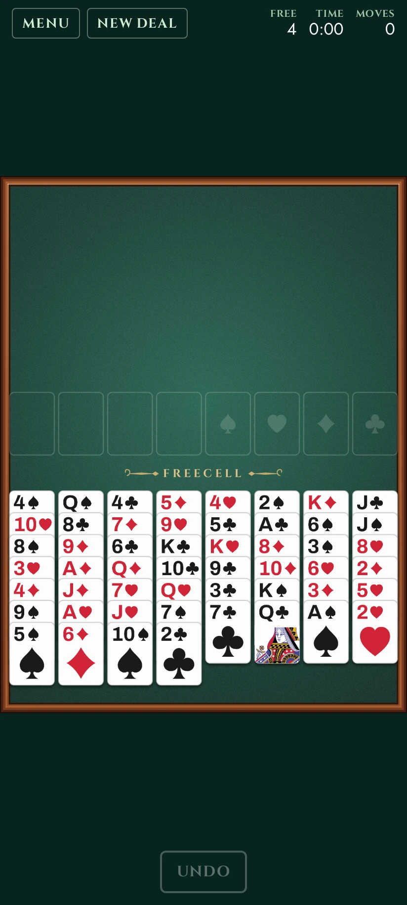<br><b>FreeCell</b></td>
<td width="25%" align="center">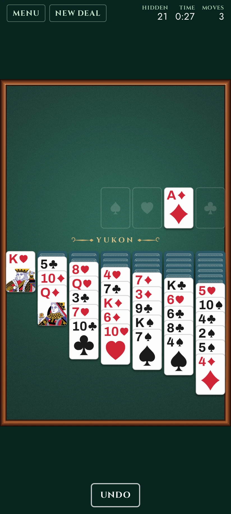<br><b>Yukon</b></td>
<td width="25%" align="center">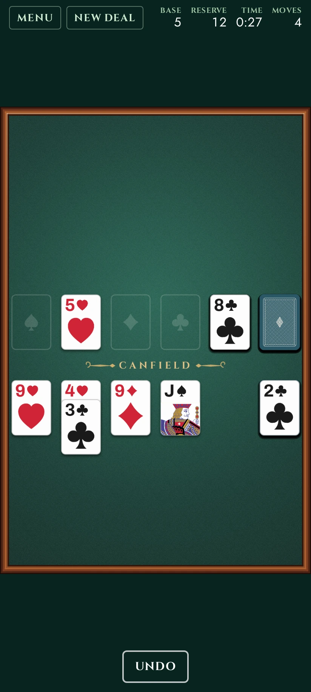<br><b>Canfield</b></td>
</tr>
<tr>
<td align="center">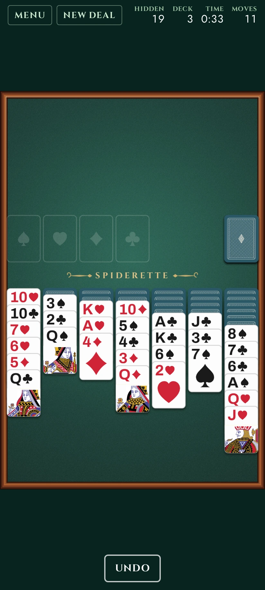<br><b>Spiderette</b></td>
<td align="center">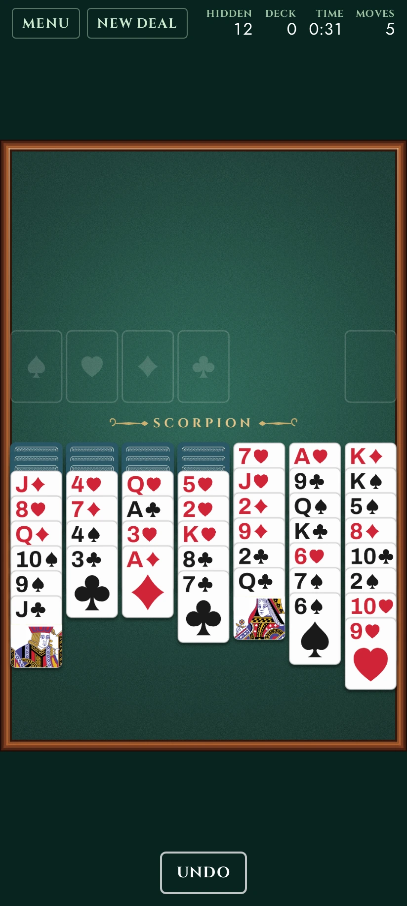<br><b>Scorpion</b></td>
<td align="center">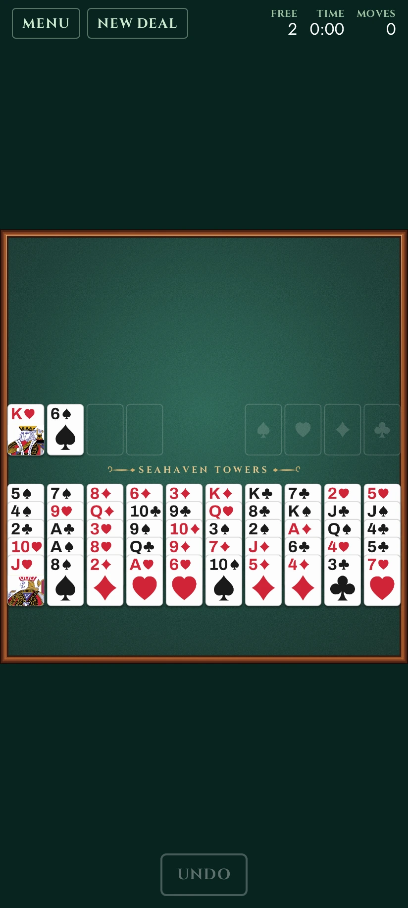<br><b>Seahaven Towers</b></td>
<td></td>
</tr>
</table>

**Match and clear** — two minutes, standing up.

<table>
<tr>
<td width="25%" align="center">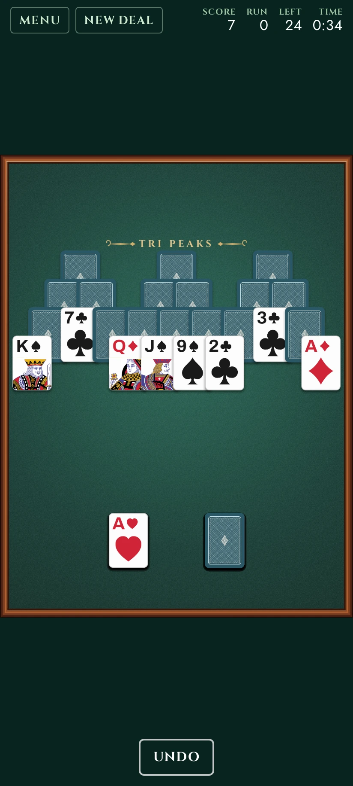<br><b>Tri Peaks</b></td>
<td width="25%" align="center">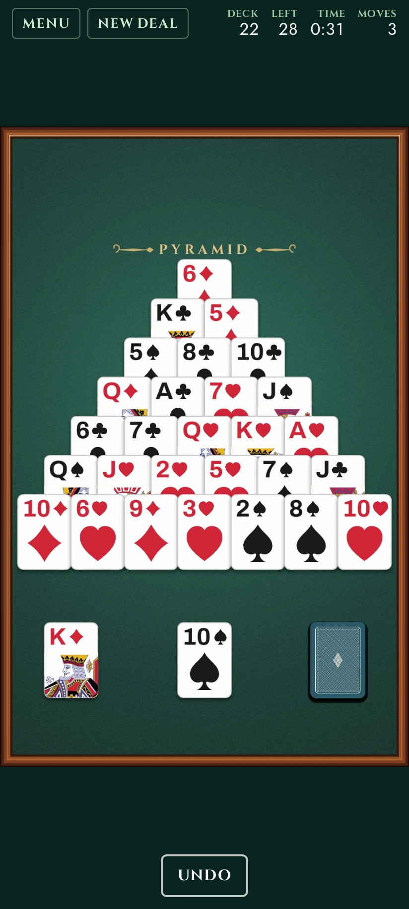<br><b>Pyramid</b></td>
<td width="25%" align="center">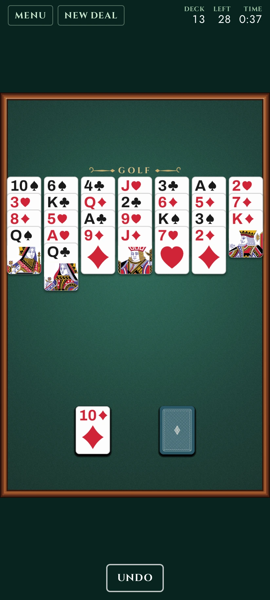<br><b>Golf</b></td>
<td width="25%" align="center">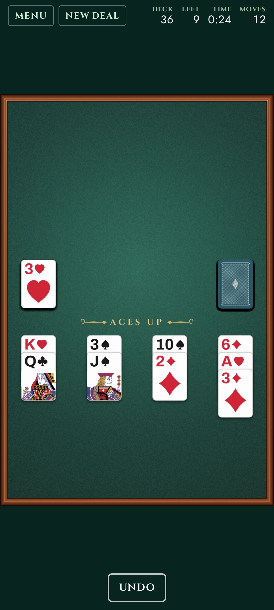<br><b>Aces Up</b></td>
</tr>
</table>

It installs to a home screen and plays with the network off. There is no
server to lose touch with, so "offline" here is only a question of whether the
browser still has the files — and it keeps them.

## The games

<table>
<tr>
<td width="50%" valign="top">

*The games of arrangement, in the order the menu lists them:*

**Klondike**, drawing one card or three. Both are offered and are scored and
recorded separately, because they are not the same game: draw-one is won most
of the time by anybody paying attention, and draw-three perhaps one hand in
ten.

**FreeCell** deals all fifty-two face up across eight columns, with four free
cells to park a card in. Nothing is hidden, so nothing is luck: of the thirty
two thousand deals Microsoft shipped, every one is solvable but #11982. A run
of cards moves as far as there is room to shuffle it — one card, plus one for
each free cell, doubled for every empty column — which is the rule the whole
game turns on.

**Yukon** is Klondike's seven columns with the deck taken away. Any face-up
card moves along with every card piled on it, in whatever order those happen
to be; only the bottom one has to fit where it lands. Everything is on the
table from the first move, so the game is digging — twenty-one cards start
face down and the board counts them down instead of a score.

**Canfield** is the gambling one — Richard Canfield sold a deck for fifty
dollars and paid five a card for whatever you got home, which worked out in
his favour: a hand goes out about one time in thirty. The card turned up first
sets the rank all four foundations build from, and both sequences go round the
corner, so a foundation counts past the king to the ace and a king goes on an
ace. The reserve is the game: thirteen cards you cannot see, only the top one
is yours, and any column you manage to empty refills from it before you can
use it.

**Spiderette** is Spider's game on one deck and seven columns. Build down by
rank ignoring suit, but pick up only a run that is all one suit — so every
convenient placement is a card buried on purpose, and that argument is the
whole game. Nothing goes home one card at a time: a suit leaves as a finished
king-to-ace run, all thirteen at once. It is here rather than Spider because
ten columns of a double deck come out at about thirty-six pixels a card on a
phone, and the cards are the game.

**Scorpion** is Yukon's grip with Spider's order. A face-up card comes away
with everything piled on it, in whatever state those cards are in, and may
only be put down on the same suit one rank higher — so a nine of hearts has
exactly one home in the whole deck, and it is very probably buried. The
hardest game here.

**Seahaven Towers** is FreeCell's furniture with two rules changed: columns
build down in *suit*, and an empty column takes a king and nothing else. So an
empty column is worth nothing unless you are holding a king, a run can never
be shuffled through one, and the only room you have is the four cells — two of
which start full. Ten columns across a phone means smaller cards; that is the
price of seeing all fifty-two at once.

*And the quick ones, which build nothing and sort nothing:*

**Tri Peaks** was the first of these and is the reason there are four. Three
peaks of cards, one card face up beside the deck, and any card you can see
that is one rank either side of it can be taken — the ranks go round the
corner, so an ace follows a king. The whole game is noticing, and it takes two
minutes.

**Pyramid** is twenty-eight cards stacked up and taken away in pairs that add
to thirteen. An ace is one, a queen twelve, and a king is thirteen on his own,
so kings leave alone. Drag one card onto another to take a pair — finding the
other half is the game, so nothing here goes looking for it on your behalf.

**Golf** is a wall of thirty-five cards cleared one rank up or down onto the
card beside the deck. The ranks do **not** go round the corner here, which is
the one rule separating it from Tri Peaks and the reason a king on the wall is
a problem rather than a card. Sixteen turns of the deck, no second pass, about
ninety seconds.

**Aces Up** deals four cards at a time onto four piles and throws away the
lower card whenever two of a suit are showing. An ace beats everything and can
never be thrown away, which is where the name and the difficulty come from.
The only decision in it is what to move into an empty column. You win about
one hand in twenty.

</td>
<td width="50%" valign="top">
<p align="center">
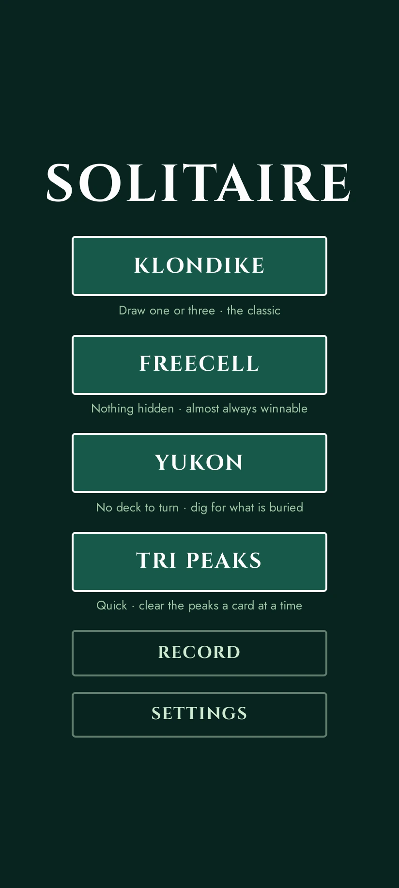
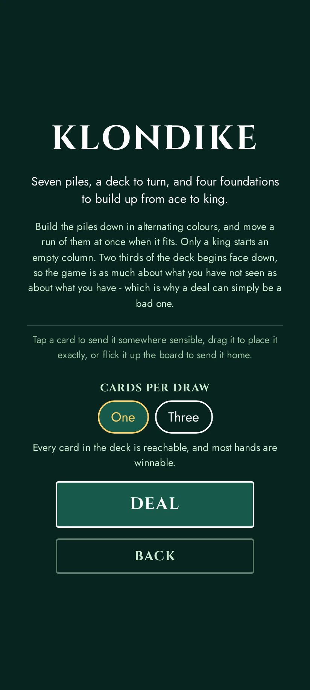
</p>
<p align="center"><i>Every game gets a page before the board — what it is,<br>and whatever it needs to ask.</i></p>
</td>
</tr>
</table>

## How you play

* **Tap** a card to send it wherever it obviously goes — its foundation if it
  can go home, otherwise a pile that will take it. An occupied pile is
  preferred to an empty one, because an empty column is a resource and filling
  it by accident is how it gets wasted.
* **Drag** a card, or a run of cards, to say exactly where it goes. The pile
  under it lights up only where the move is legal; a refused drop snaps back.
* **Flick** a card up the board and it goes to its foundation, wherever you
  let go of it. One card at a time, since that is all a foundation takes, and
  a throw the foundations will not accept costs nothing — it lands as an
  ordinary drop would have. Games with no foundations have no such gesture,
  because there would be nothing for it to mean.
* **Undo** as far back as you like, including past a win. Undoing costs
  nothing: a score is a measure of the game you played, and an undone move is
  a game that did not happen.
* **Finish** appears once every card is face up and the rest of the game is a
  formality, and plays it out. Only in the games that have such a position:
  in the Spider family a suit goes home the moment it is finished, so the
  formality has already been cleared away by the time it would arrive. The cards then fall out of the foundations and
  bounce off the bottom of the screen, which is the oldest piece of
  choreography in computer games and the only reason anybody finishes a hand
  they have already won.
* The **stock** turns a card whether you press the top of it or the empty slot
  it leaves behind — the second of those is how the waste goes back to being a
  deck.
* **Menu**, and the phone's own back gesture, open a pause menu rather than
  leaving. A hand in progress lives only on that page — there is no server
  holding it and nothing written down until it ends — so walking off the board
  is the one thing here that cannot be undone, and it takes two deliberate
  presses. The clock stops while the menu is up.

The whole layout sits low, within reach of a thumb, and rises only when a pile
grows long enough to need the room.

<p align="center">
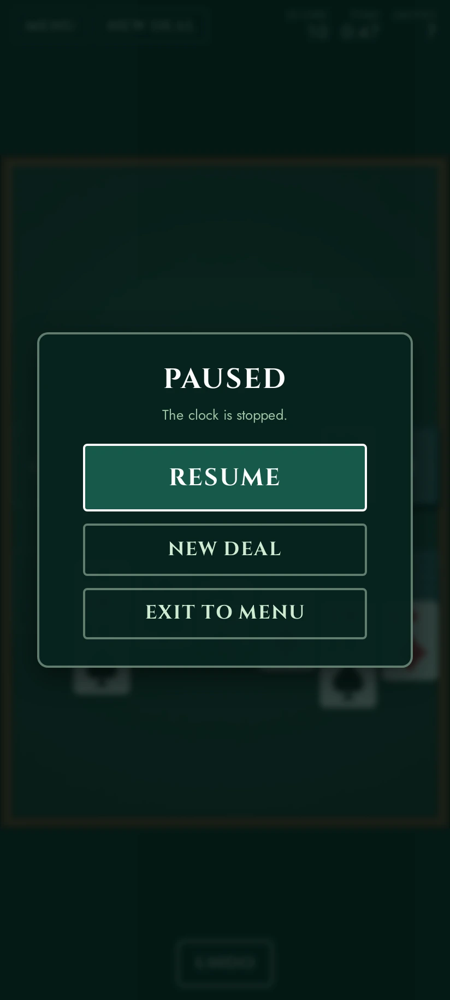
</p>

## Scoring

Windows Solitaire's standard scoring, which is what people mean when they say
a solitaire game has a score:

| | |
| --- | --- |
| Waste → tableau | +5 |
| Waste or tableau → foundation | +10 |
| Turning over a tableau card | +5 |
| Foundation → tableau | −15 |
| Turning the deck over again (draw one) | −100 |
| Turning the deck over again (draw three) | −20, after two free passes |
| Finishing | +700000 / seconds, if the game took over half a minute |

The score never goes below zero. There is **no** time penalty, which Windows
had at two points every ten seconds: on a phone a game is put down mid-hand
constantly, and a score that drains while the screen is off punishes the
interruption rather than the play. The time bonus is the other half of that
bargain — finishing quickly is still worth something, thinking slowly is not
worth anything at all.

That is Klondike's, and Klondike is the only game here with a score in that
sense. Tri Peaks keeps its own: every card taken without turning the deck is
worth more than the last, and clearing a peak is worth fifteen.

The other nine have never had a score, and none is invented for them. What
the board shows instead is whichever number that game's players actually
watch — free cells in FreeCell and Seahaven, cards still face down in Yukon
and the Spider family, rows left in the deck in Spiderette, cards left in the
reserve in Canfield, cards still standing in Pyramid, Golf and Aces Up. A score bolted onto a game that does not have one is a
number that measures nothing.

## What is remembered

Games played and won, win rate, best time, fewest moves, average length of a
win, current streak and longest streak — kept separately for each game, in
your browser's own storage. A game counts as played once you have made a move
in it, so dealing a hand, looking at it and dealing another is free.

Clearing your browser's storage clears the record. That is a real limitation
and a deliberate one: the alternative is an account, a password, and somewhere
for both to live.

## Where the art came from

The deck is [web-nert](https://github.com/exterkamp/web-nert)'s, copied rather
than shared — see [public/cards/ATTRIBUTION.md](public/cards/ATTRIBUTION.md).
The courts are Dmitry Fomin's CC0 English pattern cards; the backs are
generated guilloche line work printed over whichever colour you pick; the
suits are drawn for the deck rather than taken from a typeface, because in
most faces the club and the spade are the same blob at card size and telling
them apart is exactly what a card game asks of you.

The fonts came the same way and carry their own licences in
[public/fonts](public/fonts): Cinzel for display, Jost for text, Archivo for
the rank in a card's corner, and Schoolbell for what is written on the record
book.

No sound. Nertz has music and this does not — solitaire is the game you play
in a waiting room.

## Building it

Angular for the pages, Phaser for the board, and a hard line between them. One
board runs all eleven games; each game is a rules module of pure functions
plus a description of where its piles are printed. Adding the eleventh touched
two shared files and added three of its own.

```bash
npm install
npm start          # http://localhost:4200
npm test           # the rules, in vitest
```

Everything else — the deploy, the routing, the offline machinery, the tests
that drive a real browser — is in **[DEVELOP.md](DEVELOP.md)**.

## Licence

[CC0 1.0](LICENSE) — public domain, as far as the law allows. No attribution
required, no notice to ship, commercial use and modification both fine. Take
the rules modules, take the board, take the whole thing.

CC0 rather than MIT because the deck that made this possible arrived that way.
Dmitry Fomin put the court cards in the public domain and every deck theme
here is downstream of that; passing it on with a condition attached would be a
poor way to say thank you.

Two things in this tree are **not** covered by it, and cannot be: the fonts in
[public/fonts](public/fonts) are third-party (three SIL OFL 1.1, one Apache
2.0 — all fine to redistribute, none of them mine to dedicate), and `npm
install` brings in Angular, Phaser and the rest under their own licences.
Everything else — the rules, the board, the art in
[public/cards](public/cards), the words — is CC0.
